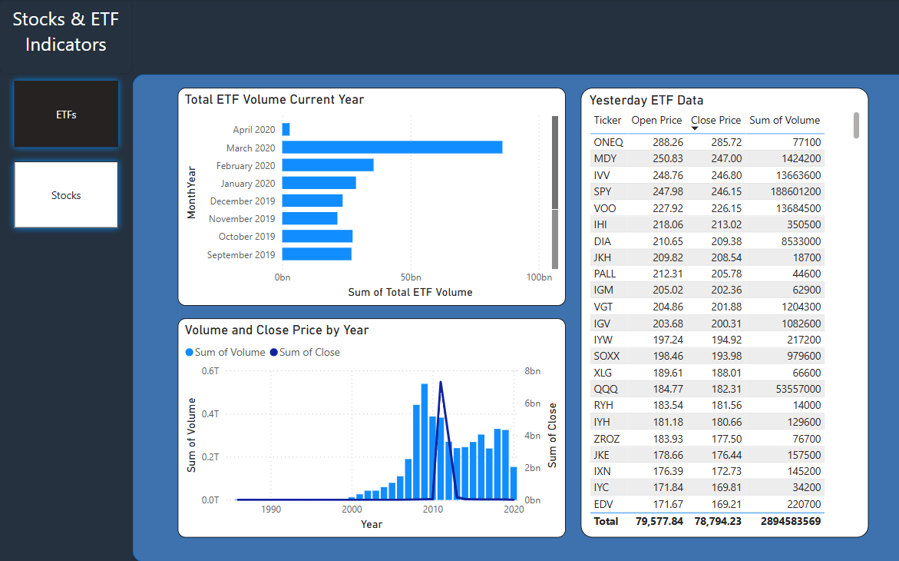
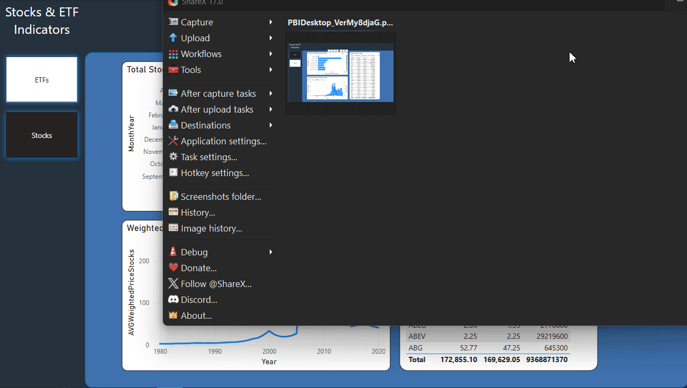

# Stocks & ETFs Indicators Dashboard
This project provides a simple Power BI dashboard for a Kaggle dataset about stocks and etfs prices.  
This dataset contains daily observations of opening and closing prices for all tickers currently (1980-2020) trading on NASDAQ.  
My goal was to create a simple Power BI dashboard that can be useful to get some insights about financial data.  
I imported all the etf csv on Power BI and used "Combine" on them to have a full etf table, containing day-to-day etf price infos.  
I imported all the stocks csv on Power BI and used "Combine" on them to have a full stocks table, containing day-to-day etf price infos.  
Finally, I imported the symbols_valid_meta.csv on Power BI, and added relationship to the etf and stocks tables using the 'Symbol' columns.  
In the page "Stocks" you will find three charts:  
- Total Stocks Volume Current Year: this chart shows the total Stocks volume aggregated by month, in the last available year in the dataset
- Weighted Average Price of Stocks: this chart reports the total weighted average price of stocks, aggregated by year
- Yesterday Stocks Data: this chart shows some informations regarding the latest available day in the dataset.

In the page "ETFs" you will find three charts:  
- Total ETF Volume Current Year: this chart shows the total ETF volume aggregated by month, in the last available year in the dataset  
- ETF Volume and Closing Price by Year: this chart reports the total ETF volume and price aggregated by year  
- Yesterday ETF Data: this chart shows some informations regarding the latest available day in the dataset  

## Dashboard Pages
  

  

## How to Use

1. **Download the Dataset**:
   - [Download the Dataset](https://www.kaggle.com/datasets/jacksoncrow/stock-market-dataset/data).
   
2. **Download the Power BI file**:
   - [Download the .pbix file](https://drive.google.com/file/d/1ilVkD060Kr9gt42vuoBWL7jql9fN4uPi/view?usp=sharing).
   
3. **Open the file in Power BI Desktop**:
   - Make sure you have **Power BI Desktop** installed on your computer. You can download it for free from [Power BI Desktop](https://powerbi.microsoft.com/desktop/).
   
4. **Interact with the Dashboard**:
   - Once the file is open in Power BI, you can filter the data by year, ETF, or stock, and dynamically view the charts.

## Observations
The etfs data require further analysis. At first, in my approach, I wanted to have as well a chart regarding the weighted average price for etfs as well, but I have noticed that a few ETF have much bigger volume than all the others, and this was affecting the weighted average, making it constant.  
Furthermore, some of the biggest ETF have missing years data.

## Next Steps
I would like next to continue analyzing the ETF data in particular since I have noticed some inaccuracies.
Next, I would like to update the dataset to include the data about the period 2021-present.
Finally, It would be interesting to automatise this dashboard, so that it can always show the most recent data.

## Contributions

If you'd like to contribute to this project, feel free to **fork** and submit **pull requests**. Please follow the contribution guidelines (if any).

## Useful Links
- [Power BI Official Website](https://powerbi.microsoft.com/)
- [GitHub Power BI Repository](https://github.com/Microsoft/PowerBI)
